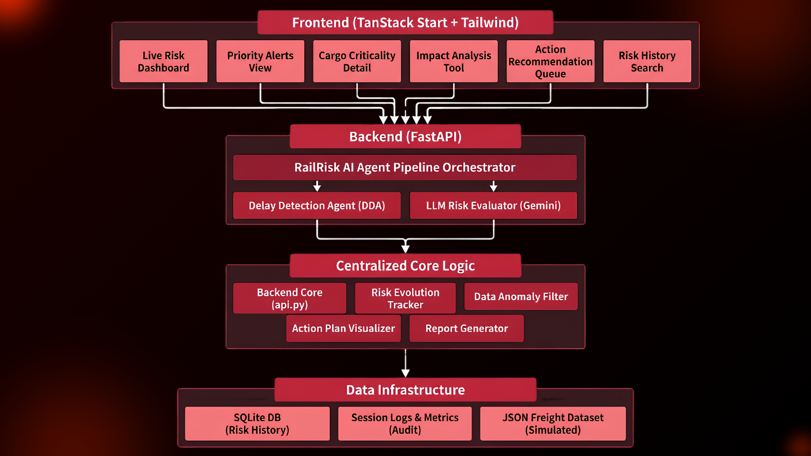
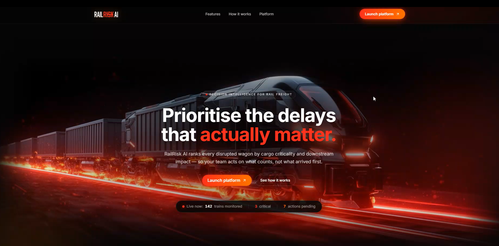
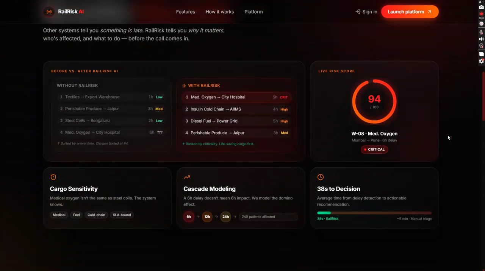
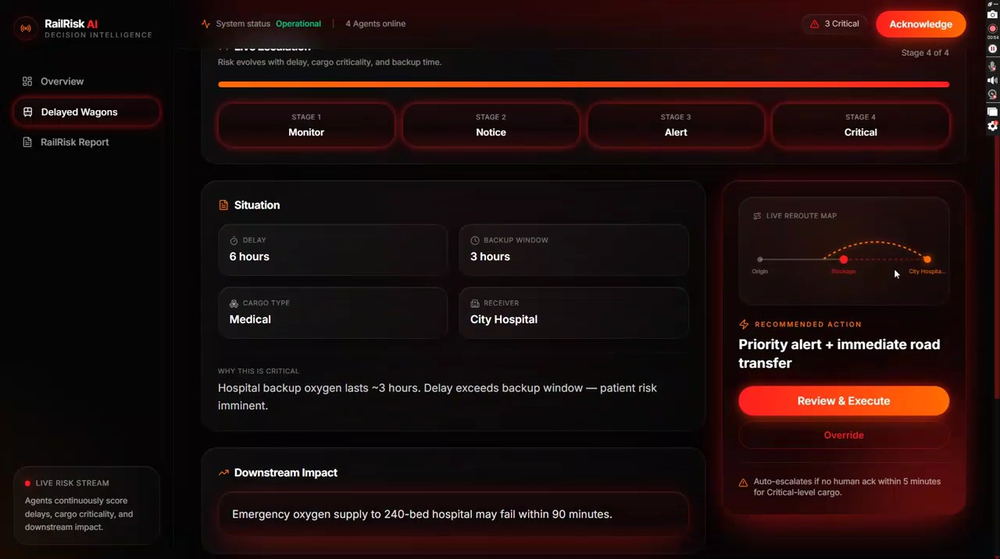
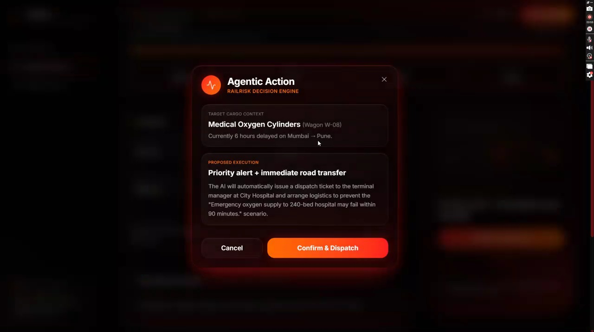
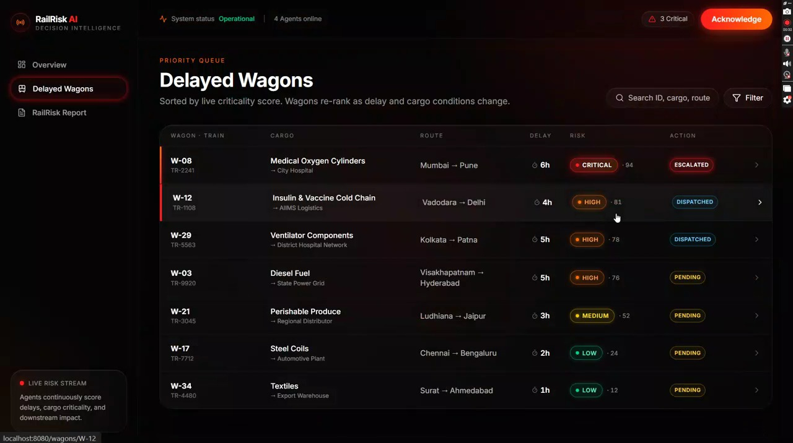
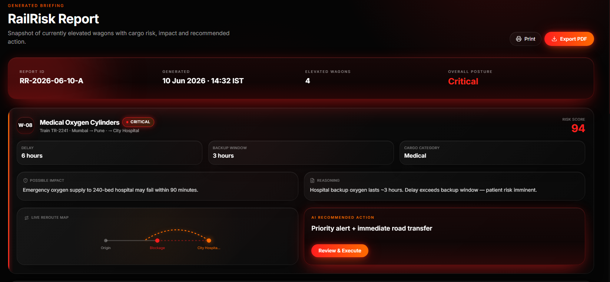
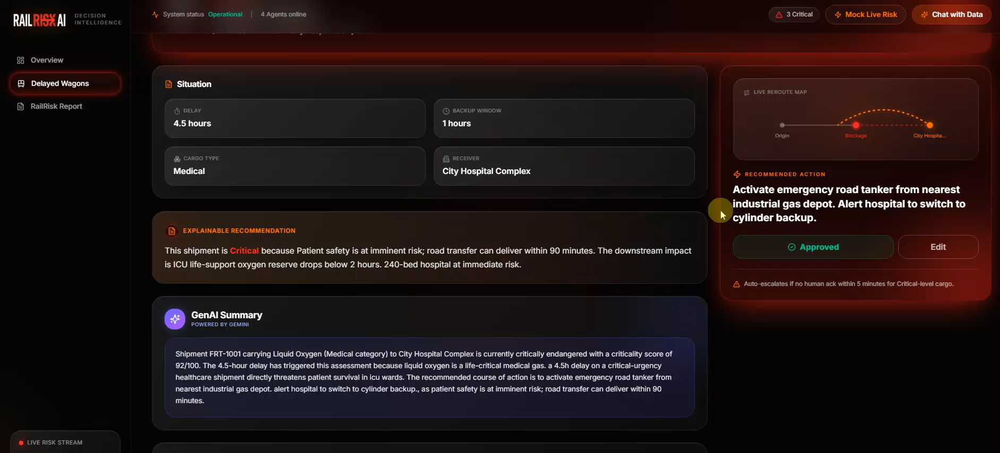
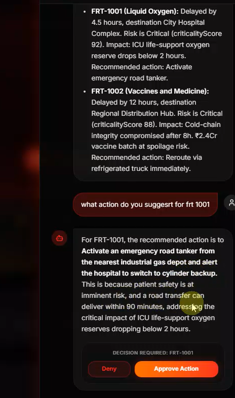
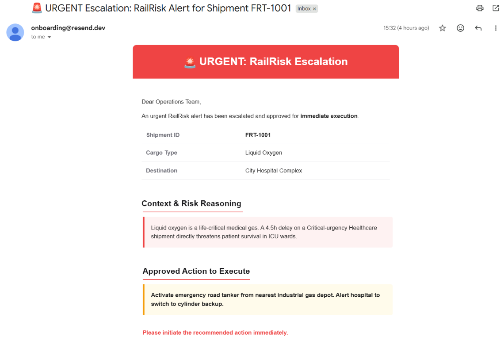

# RAILRISK AI: Autonomous Disruption Risk Intelligence for High-Stakes Freight Logistics

<p align="center">
  
</p>

<p align="center">
  <strong>Bridging the gap between mere delay tracking and actionable risk understanding for Indian Railways.</strong>
</p>

<p align="center">
  <strong>🏆 Built for FAR AWAY 2026 — India's Biggest International Hackathon 🏆</strong>
</p>

---

## 🎥 Demo Video & Pitch Deck

### Project Video Demo
**[▶️ Watch the RailRisk AI Demo Video](Frontend/src/assets/Railrisk_demo.mp4)**

### Presentation
**[📑 Read the Pitch Deck (PDF)](Frontend/src/assets/RailRiskAI_PPT.pdf)**

---

## 💡 Problem Statement

Current railway freight systems are purely tracking-based, leading to critical visibility gaps:

- **Missing Cargo Context:** A delayed train simply shows as "delayed." The system doesn't differentiate between a delayed wagon of steel and a delayed wagon of medical oxygen.
- **Hidden Downstream Risks:** Delays don't just affect the train; they impact hospitals, factories, and supply chains waiting for the cargo.
- **Reactive Logistics:** Existing dashboards only display raw data, leaving human dispatchers to manually deduce risk priority in high-stakes emergencies.

**RailRisk AI solves this** by deploying a hybrid Machine Learning & Generative AI pipeline that autonomously evaluates cargo priority, predicts downstream impact, and recommends mitigation actions *before* a delay becomes a crisis.

---

## ✨ Features

- **🧠 Hybrid AI Pipeline** – Local Scikit-Learn Random Forest model for delay severity prediction, combined with a unified LangChain Gen-AI orchestrator.
- **📊 Live Risk Dashboard** – Monitor high-priority alerts and critical cargo in one view.
- **📝 Automated Risk Reports** – AI-generated reports explaining criticality, impact prediction, and recommended actions.
- **🤖 Action Recommendation** – Automated suggestions (reroute, road transfer, priority alert).
- **💬 Chatbot Integration** – Human-in-the-loop approval workflows via integrated chat.
- **📧 Smart Alerts** – Instant email notifications via Resend API for critical shipments.

---

## 🛠️ Tech Stack

### Frontend
| Technology | Purpose |
|------------|---------|
| **React 18** | UI framework |
| **TanStack Start** | SSR, file-based routing, and full-stack React framework |
| **Tailwind CSS v4** | Modern styling and responsive design |
| **Vite** | Fast development & building |

### Backend & AI Pipeline
| Technology | Purpose |
|------------|---------|
| **Python 3 + FastAPI** | High-performance REST API server |
| **Scikit-Learn** | Random Forest ML model for predictive delay analysis |
| **LangChain** | LLM orchestration and agentic pipeline management |
| **Google Gemini 2.5 Flash** | AI reasoning, criticality scoring, and impact prediction |
| **SQLite** | Lightweight database for risk history storage |
| **Resend API** | Automated critical alert email delivery |

---

## 📸 Application Screenshots

### Landing Page & Dashboard
| Hero Section | Live Dashboard |
|:---:|:---:|
|  |  |

### Risk Management & Action Control
| Action Dashboard | Action Card | Risk List |
|:---:|:---:|:---:|
|  |  |  |

### AI Insights & Configuration
| AI Risk Report | Gen AI Configuration |
|:---:|:---:|
|  |  |

### Human-in-the-Loop & Automated Alerts
| Chatbot Approval Flow | Automated Email (Resend) |
|:---:|:---:|
|  |  |

---

## 📁 Project Structure

```text
railrisk-ai/
├── Backend/
│   ├── src/
│   │   ├── api.py          # FastAPI app & all endpoints
│   │   ├── agents.py       # 4-layer LLM agent logic
│   │   ├── pipeline.py     # Agent orchestration
│   │   ├── executor.py     # Email dispatch via Resend
│   │   └── ml_model.py     # Delay severity ML model
│   ├── data/               # Freight dataset (JSON)
│   ├── config/             # Rules configuration
│   └── requirements.txt
├── Frontend/
│   ├── src/
│   │   ├── routes/         # TanStack Router pages
│   │   ├── components/     # UI components
│   │   └── lib/            # API client & utilities
│   └── package.json
├── assets/
│   └── screenshots/        # App screenshots for README
└── README.md
```

---

## 🚀 Getting Started

### 🔑 Environment Variables

**Backend (`Backend/.env`):**
```env
GEMINI_API_KEY=your_gemini_api_key
RESEND_API_KEY=your_resend_api_key
RECIPIENT_EMAIL=your_email@example.com
```

**Frontend (`Frontend/.env.local`):**
```env
VITE_API_URL=http://localhost:8000
VITE_GEMINI_API_KEY=your_gemini_api_key
```

### 1. Backend Setup (FastAPI + AI Agents)

```bash
cd Backend

# Create & activate virtual environment
python -m venv venv
# Windows:
venv\Scripts\activate
# Mac/Linux:
source venv/bin/activate

# Install dependencies
pip install -r requirements.txt

# Setup Environment Variables
cp .env.example .env
# Edit .env and add your GEMINI_API_KEY and RESEND_API_KEY

# Seed the database and run the server
python seed_reports.py
uvicorn src.main:app --reload --port 8000
```

### 2. Frontend Setup (TanStack Start)

```bash
cd Frontend

# Install dependencies
npm install

# Setup Environment Variables
cp .env.example .env
# Edit .env and add your VITE_GEMINI_API_KEY and VITE_OPENROUTER_API_KEY

# Start the development server
npm run dev
```
The frontend will be available at `http://localhost:3000` (or the port specified by Vite).

---

## ⚠️ Disclaimer
RailRisk AI is a risk intelligence tool — it estimates criticality, flags high-risk delays, and recommends priority actions for human review. It does not claim to predict outcomes with certainty. Final decisions remain with the operating authority.

---

## 🏆 Team RootSignal

**Competition:** FAR AWAY 2026 — India's Biggest International Hackathon  
**Theme:** Railways · Logistics & Transit · Agentic & Autonomous Systems

| Name | Role |
| :--- | :--- |
| **Ekta** | Strategy, Problem Framing, Content, Team alignment |
| **Devang** | Readme, Deployment, ML integration, API |
| **Aryan** | Full Stack: Frontend Architecture , UI/UX, Backend, LangChain agents |
| **Piyush** | Pitch, storytelling, Final Presentation |
| **Mannu** | Coordination, Testing, Submission |

> *A delayed wagon carrying steel is an inconvenience.*
> *A delayed wagon carrying oxygen is a life-or-death decision.*
> **RailRisk AI ensures that decision is never missed.**
